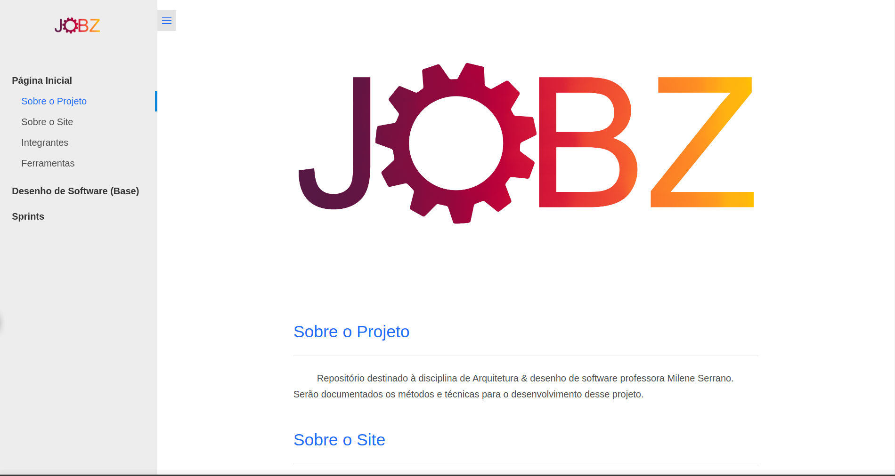
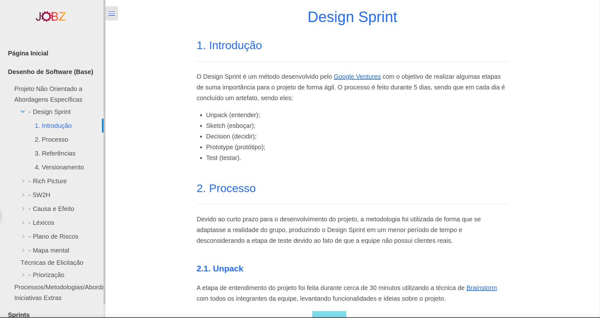
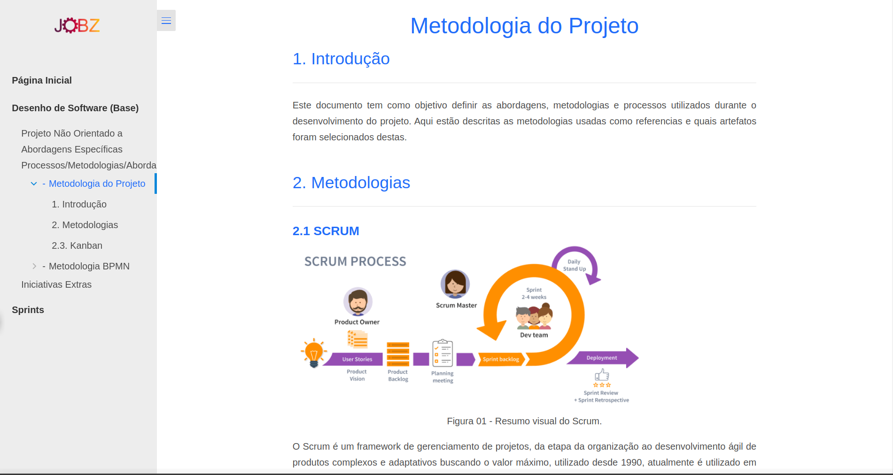
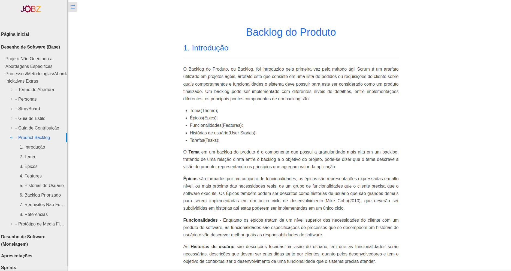
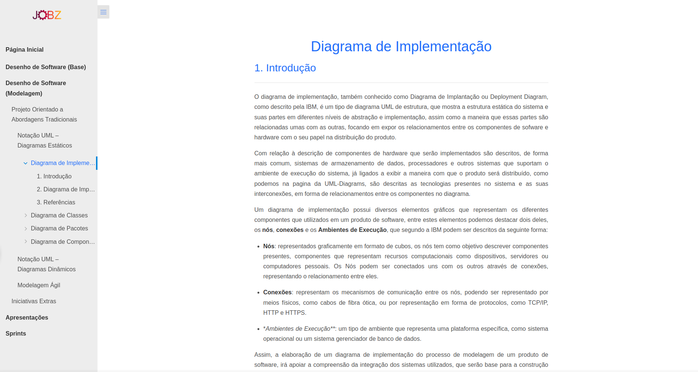
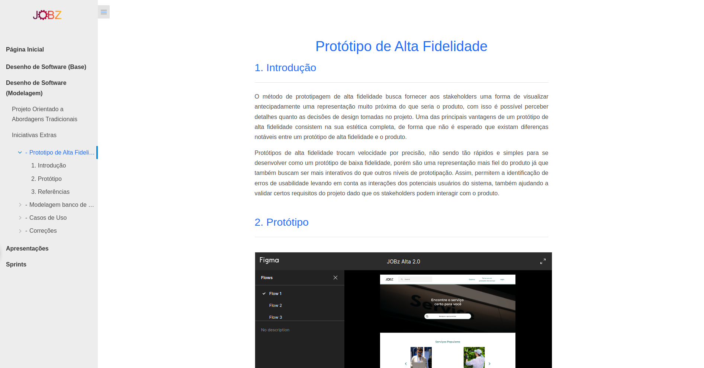
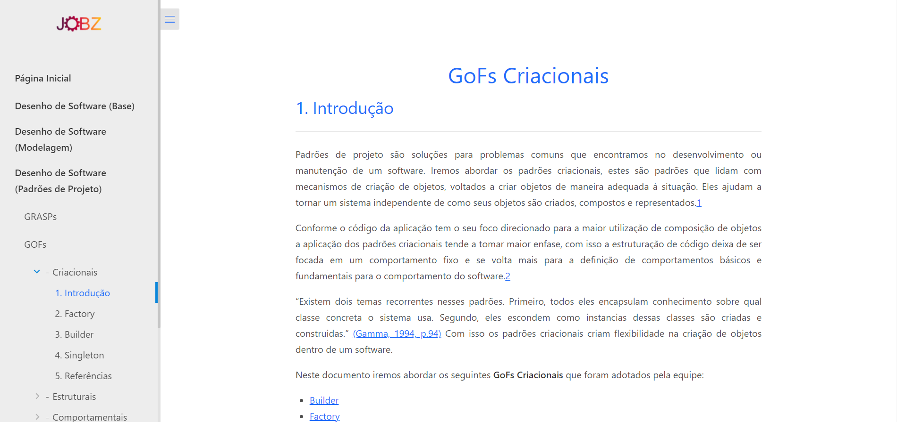
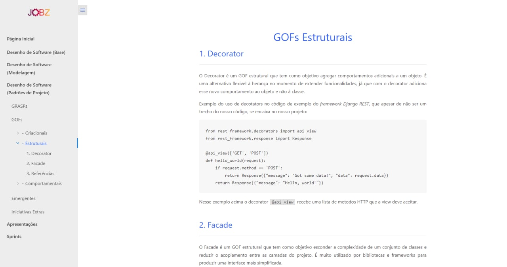
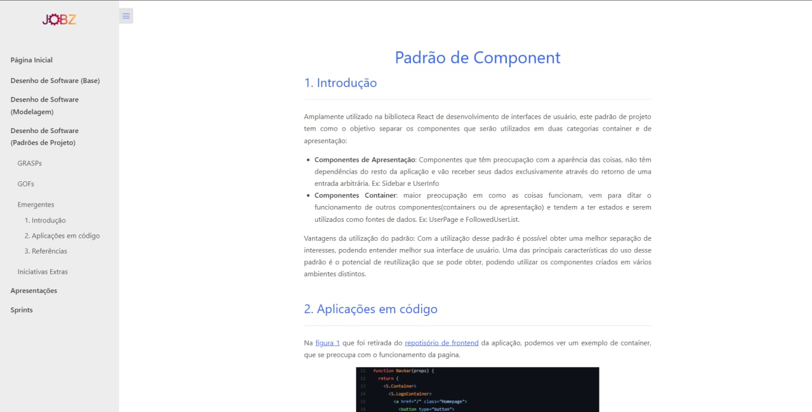
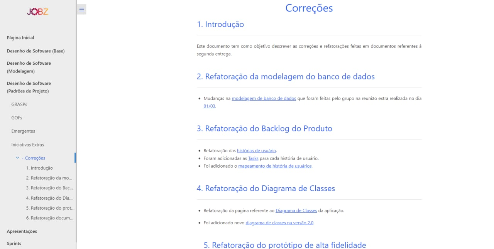

# Jobz

**Código da Disciplina**: FGA0208<br>
**Número do Grupo**: 06<br>

## Alunos

| Matrícula  | Aluno                            | GitHub                                                 |
| ---------- | -------------------------------- | ------------------------------------------------------ |
| 18/0012002 | Álvaro Gouvea                    | [@AlGouvea](https://github.com/AlGouvea)               |
| 20/2028211 | Antonio Aldisio                  | [@AntonioAldisio](https://github.com/AntonioAldisio)   |
| 17/0006328 | Ariel Vieira Lima Serafim        | [@ArielSixwings](https://github.com/ArielSixwings)     |
| 19/0106565 | Fernando Miranda Calil           | [@ilus1](https://github.com/ilus1)                     |
| 18/0018159 | Guilherme Braz                   | [@GuilhermeBraz](https://github.com/GuilhermeBraz)     |
| 17/0013987 | João Victor de Oliveira Matos    | [@joao15victor08](https://github.com/joao15victor08)   |
| 19/0032863 | Lorrayne Alves Cardozo           | [@LorrayneCardozo](https://github.com/LorrayneCardozo) |
| 18/0042661 | Luis Fernando Furtado De Araújo  | [@luis-furtado](https://github.com/luis-furtado)       |
| 19/0036435 | Pedro Henrique Carvalho Campos   | [@Peh099](https://github.com/Peh099)                   |
| 19/0048221 | Rodrigo Balbino Azevedo de Brito | [@Balbinoo](https://github.com/Balbinoo)               |

## Sobre

Uma aplicação web para conectar pequenas empresas, profissionais autonomos que realizam serviços de concerto e manutenção geral, à clientes que buscam por esse serviços.

## Screenshots Primeira Entrega <<FOCO: DSW(Base)>>






## Vídeo(s) Primeira Entrega <<FOCO: DSW(Base)>>

[Projeto Não Orientado a Abordagens Específicas](https://www.youtube.com/watch?v=eT3nrE5kbbQ) 

[Processos/Metodologias/Abordagens](https://www.youtube.com/watch?v=rfFAu3dBPeM)

[Iniciativas Extras](https://www.youtube.com/watch?v=QfjaEft9OEA)

## Screenshots Segunda Entrega <<FOCO: DSW(Modelagem)>>






## Vídeo(s) Segunda Entrega <<FOCO: DSW(Modelagem)>>


[Notação UML – Diagramas Estáticos](https://www.youtube.com/watch?v=5ZAOZhQOJvI) 

[Notação UML – Diagramas Dinâmicos](https://www.youtube.com/watch?v=4SzbcVgd2f8)

[Modelagem Agil](https://www.youtube.com/watch?v=zhntwoTsx70)

[Iniciativas Extras](https://www.youtube.com/watch?v=fhQ_-XiADMQ)

## Screenshots Terceira Entrega <<FOCO: DSW(Padrões de Projeto)>>








## Vídeo(s) Terceira Entrega <<FOCO: DSW(Padrões de Projeto)>>

[GRASPs](https://youtu.be/jic8z553Xeo ) 

[GOFs](https://www.youtube.com/watch?v=OAdXKxiUW7E)

[Padrões Emergentes](https://www.youtube.com/watch?v=qA6_NSfRncE)

[Iniciativas Extras](https://www.youtube.com/watch?v=XkZczDKdXRg)

## Screenshots Quarta Entrega (FINAL) <<FOCOS: Arquitetura & Reutilização de Software & PROJETO FINAL>>

Adicione 2 ou mais screenshots do projeto em termos de interface e/ou funcionamento.

## Vídeo(s) Quarta Entrega (FINAL) <<FOCOS: Arquitetura & Reutilização de Software & PROJETO FINAL>>

Adicione o(s)s vídeo(s) da Entrega Final.

## Descritivo dos Principais Aspectos Técnicos

**Principal(is) Metodologia(s) Adotada(s)**: xxxxxx<br>
**Principais Linguagens Utilizadas e/ou Pretendidas**: xxxxxx<br>
**Principais Tecnologias Utilizadas e/ou Pretendidas**: xxxxxx<br>
**Principal(is) Estilo(s) Arquitetural(is) Adotado(s)**: xxxxxx<br>

## O Projeto está rodando?

( X ) SIM
( ) NÃO
### Pré requisitos:

Docker => 20.10.12

Docker compose => 1.29.2

### Passo a passo para rodar

1. Clone o [Jobz Backend](https://github.com/UnBArqDsw2021-2/2021.2_G6_Jobz_BackEnd) ou [Jobz Backend](https://github.com/UnBArqDsw2021-2/2021.2_G6_Jobz_FrontEnd).
```
git clone https://github.com/UnBArqDsw2021-2/2021.2_G6_Jobz_FrontEnd.git
```
ou 

```
git clone https://github.com/UnBArqDsw2021-2/2021.2_G6_Jobz_BackendEnd.git
```

2. Entre na pasta /deploy.

3. Rodar o projeto
```
make run
```
4. Parar o projeto.
```
make stop
```

## Informações Complementares

Existe automação para criação da imagem docker para o frontend e backend

```
docker push antonioaldisio/jobzfrontend
```

```
docker push antonioaldisio/jobzbackend
```
