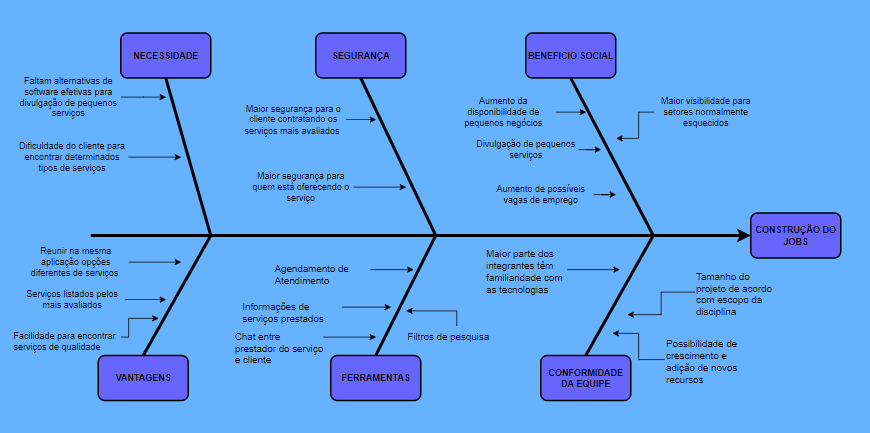

# 
Causa e Efeito (Diagrama de Ishikawa)

## 1. Introdução

O diagrama Causa-Efeito (ou diagrama de Ishikawa) analisa sobre diferentes perspectivas ou pontos de vistas um determinado efeito, levantando uma série de causas que podem estar fazendo com que esse efeito aconteça. Normalmente a utilização de um diagrama de Causa-Efeito é baseada no fato de se ter um problema, risco ou algo que foi vislumbrado pelo(s) autor(es) de algo que já está acontecendo ou ainda pode acontecer. A partir da identificação de um efeito são vislumbrados possíveis causas distribuídas por tópicos e sub-tópicos.

Para o nosso projeto o diagrama de Causa-Efeito será utilizado como um dos artefatos base para a modelagem dos requisitos propostos para o software em questão. Segue abaixo o diagrama que foi construído.

## 2. Diagrama

_Figura 1 - Diagrama Causa-Efeito criado pelo grupo._

## 3. Referências

> SERRANO, Milene; Requisitos - Aula - PROJETO E DESENHO DE SOFTWARE;

> Rodrigues, Viviane. Diagrama de Ishikawa: o que é e como fazer. 2021. Disponível em: https://www.siteware.com.br/metodologias/diagrama-de-ishikawa/

## 4. Versionamento

| Versão | Data       | Modificação          | Autor(es)        |
| :----: | ---------- | -------------------- | ---------------- |
|  1.0   | 28/01/2022 | Criação do documento | Rodrigo Balbino  |
|  1.1   | 28/01/2022 | Adição de conteúdo   | Pedro Campos     |
|  1.2   | 29/01/2022 | Revisão do documento | Lorrayne Cardozo |
